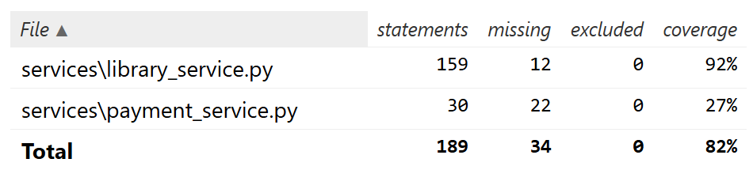
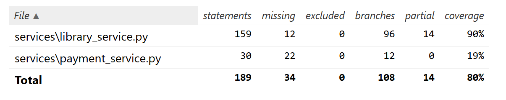
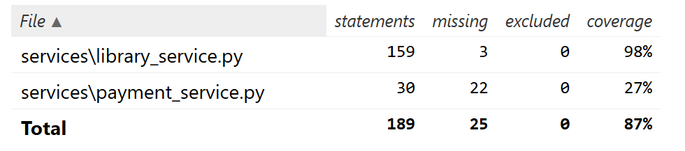
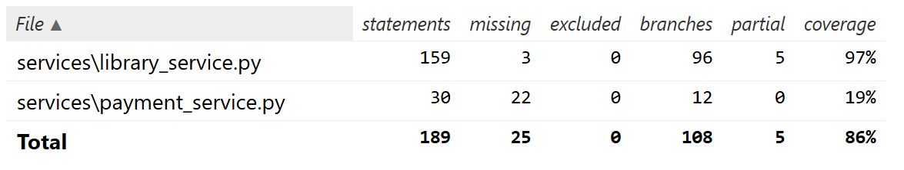
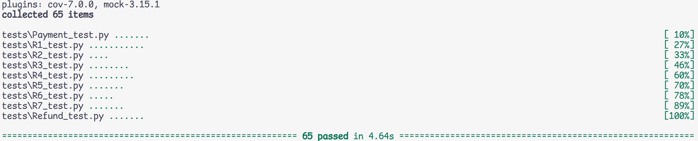
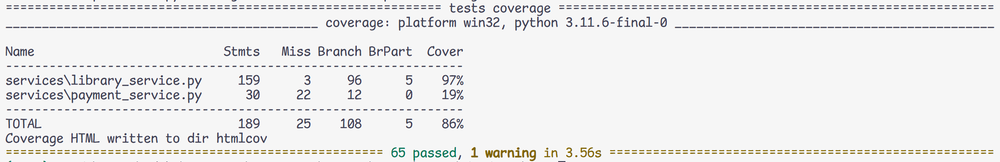

# Section 1 - A3 - Matt Dobaj - 20350312 - TA Group 1
Github repo: [https://github.com/dobaj/cisc327-library-management-a2-0312](https://github.com/dobaj/cisc327-library-management-a2-0312)

# Section 2 - Stubbing vs. Mocking
Stubs are a small part of a test suite that replaces a function with a basic predefined response. Functions that I replaced with stubs for the payment service tests were `calculate_late_fee_for_book` and `get_book_by_id`. These were functions that the `pay_late_fees` function called to determine how much to charge the customer and to get the book title for the transaction description. Because these functions are not crucial to the functionality of the payment and their interaction does not neccessarily need to be monitored, stubs were used. Other stubs were also used to simulate the `insert_book`, `insert_borrow_record`, `update_book_availability`, and `update_borrow_record_return_date` functions to simulate database errors for testing other `library_service` functions.

Mocks are similar to stubs in that they have a predefined response, but they can be monitored to ensure that the correct arguments are used when calling the mocked function or that they are called a certain number of times. This is important for the `process_payment` and `refund_payment` functions that need to have their inputs verified and need to be called either never or only once to prevent over charging / refunding the user. These functions shouldn't be called when the `pay_late_fees` or `refund_late_fee_payment` functions encounter a problem with their inputs or when the `calculate_late_fee_for_book` and `get_book_by_id` functions encounter problems. We can use `assert_called_once()` or `assert_not_called()` to verify how many times a mock is called, or `assert_called_with()` to ensure the correct arguments were passed.

# Section 3 - Test Execution Instructions
For setup I had to install some packages outlined in the assignment description:
```
pip install requests
pip install pytest-mock
pip install pytest-cov
```

To run the tests individually, you can use pytest:
```
pytest -s tests/Payment_test.py 
```
or
```
pytest -s tests/Refund_test.py 
```

To run them collectively the pytest command can be used:
```
pytest
```
And to generate a report, the command from the assignment description can be used:
```
pytest --cov=services --cov-report=html --cov-report=term tests/
```

You can then see the results of the tests by looking at the `index.html` file in the `htmlcov` folder.

# Section 4 - Test Cases Summary

## Payment Tests
Test Function Name | Purpose | Stubs Used | Mocks Used | Verification Done
--|--|--|--|--
test_successful | Tests a successful payment with valid parameters. | validBookStub (returns fake book), lateStub (returns a dict with a late fee) | process_payment (returns success) | Called process_payment once, called process_payment with correct input. 
test_gateway_declined | Tests a payment with the correct parameters but a declined payment. This is to test that the function recognizes problems with payments. | validBookStub (returns fake book), lateStub (returns a dict with a late fee) | process_payment (returns failure) | Called process_payment once, called process_payment with correct input. 
test_invalid_late | Tests a payment with the correct parameters but the late payment calculation returns invalid data. Tests for proper handling of invalid data. | validBookStub (returns fake book), invalidLateStub (returned dict is missing data) | process_payment (returns success) | Never called process_payment. 
test_invalid_book | Tests a payment with a missing book. This is to test that the function properly handles invalid data. | invalidBookStub (returns None), lateStub (returns a late fee) | process_payment (returns success) | Never called process_payment.
test_bad_patron | Tests a payment with an invalid patron id. This is to test that the function properly handles invalid inputs. | validBookStub (returns fake book), lateStub (returns a late fee) | process_payment (returns success) | Never called process_payment.
test_not_late | Tests a payment for a book that is not overdue. This is to test that the function properly handles cases that don't need payment. | validBookStub (returns fake book), notlateStub (returns a dict with a late fee of 0 and no days overdue) | process_payment (returns success) | Never called process_payment.
test_network_error | Tests a late payment with a thrown network error. This is to test that the function catches possible errors. | validBookStub (returns fake book), lateStub (returns a late fee) | process_payment (throws error) | Called process_payment once, called process_payment with correct input.

## Refund Tests
Because the `refund_late_fee_payment` function does not use any other functions than the `refund_payment` function, no stubs were neccessary.

Test Function Name | Purpose | Stubs Used | Mocks Used | Verification Done
--|--|--|--|--
test_successful | Tests a successful return with valid parameters. | | refund_payment (returns success) | refund_payment called once. refund_payment called with correct input.
test_txn_reject | Tests a return with an invalid transaction id. This is to test input checking. | | refund_payment (returns success) | refund_payment not called.
test_negative_refund | Tests a return with a negative refund amount. This is to test input checking. | | refund_payment (returns success) | refund_payment not called.
test_refund_too_much | Tests a return with a refund amount larger than 15. This is to test input checking. | | refund_payment (returns success) | refund_payment not called.
test_refund_zero | Tests a return with a refund amount equal to 0. This is to test input handling. | | refund_payment (returns success) | refund_payment not called.
test_gateway_declined | Tests a return with a failed transaction. This is to test that the function recognizes problems with refunds. | | refund_payment (returns failure) | refund_payment called once. refund_payment called with correct input.
test_network_error | Tests a return with a thrown network error. This is to test that the function catches possible errors. | | refund_payment (throws error) | refund_payment called once. refund_payment called with correct input.

## New Library Service Tests
Test Function Name | Requirement | Purpose | Stubs Used 
--|--|--|--
test_add_book_invalid _author_too_long | R1 | Tests the input checking of the add book function. | | |
test_add_book_duplicate | R1 | Tests to ensure a duplicate book cannot be added. | | |
test_add_book_db_error | R1 | Tests to ensure database errors are handled properly. | insertBookFalse (returns False) | |
test_borrow_book_insert _db_error | R3 | Tests to ensure database errors are handled properly. | insertBorrowFalse (returns False) | |
test_borrow_book _availability_db_error | R3 | Tests to ensure availabillity database errors are handled properly. | updateAvailFalse (returns False) | | 
test_return_book _late_error | R4 | Tests to ensure improper responses from the calculate late fees function are handled correctly. | invalidLateStub (returns with missing fee_amount and status) | |
test_return_book_update _borrow_error | R4 | Tests to ensure borrow database errors are handled correctly. | updateBorrowFalse (returns False) | |
test_return_book _availability_error | R4 | Tests to ensure availability database errors are handled correctly. | updateAvailFalse (returns False) | |
test_patron_status _books_borrowed _late_error | R7 | Tests to ensure improper responses from the calc late fees function are handled properly | invalidLateStub (returns with missing fee_amount and status) | |

\newpage
# Section 5 - Coverage Analysis
### Before: 


Areas without coverage were lines of code handling cases where database errors occur or where a dependent function returns an error. There were also lines missing for the cases where an author's name is too long or when a book already exists when adding a book. Lines that define the PaymentGateway when not already defined were also missing coverage, which was unavoidable as we were mocking it. The entire payment_service file was also missing coverage, but we cannot test this as we were supposed to mock it.

Branch coverage:



Overall, the project had 82% statement coverage and 80% branch coverage.

### After: 


Now the only areas lacking test coverage were the lines that define the PaymentGateway and the payment_service functions. Added tests are listed in section 4 under New Library Service Tests. These mostly revolve around testing database error handling and handling improper `calculate_late_fee_for_book` responses. For R1, new tests were added for the cases of adding a book with an author who's name is too long or adding a duplicate book.

Branch coverage:



Overall, the project now has 87% statement coverage and 86% branch coverage.

# Section 6 - Challenges and Solutions
One particular issue I encountered when testing the payment method was that I found the stub I made for the `get_book_by_id` function wasn't overriding the original function. This would cause the wrong book to be returned and it could possibly throw an error if left unresolved. To fix this I had to look through documentation and search online for other people encountering the same issue. I realized to fix this I should be patching not where the function was defined but where it was used. The patch path changed from `"database.get_book_by_id"` to `"services.library_service.get_book_by_id"`. This allowed the function to be overridden properly and later helped when stubbing other functions to fill in the code coverage.

I also had an issue with my "returning borrowed books" tests. Because I first borrowed a book to then return in the tests, when I stubbed the update_book_availability function the borrow function ended up failing before the return function could be tested. This was fixed by placing the stub just before the function I wanted to test so that the borrow function would use the original function.

I've learned that the key to successful stubbing (and I'm sure this extends to mocking) is to be specific about where and when to stub functions. It is important to override the function only where it is going to be used, not where it is defined, and to override it only just before it should be used.

# Section 7 - Screenshots 
Tests:



Coverage:


