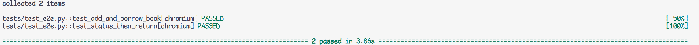
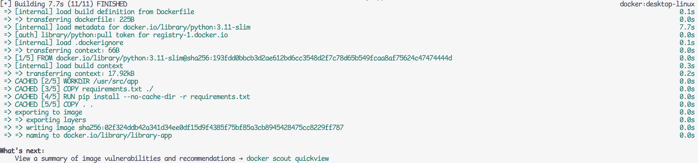
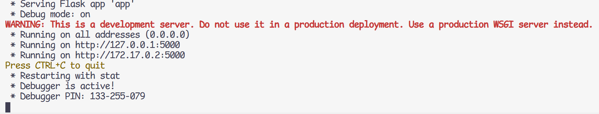
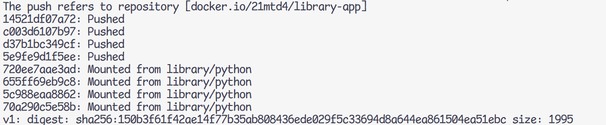
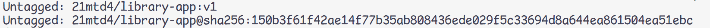
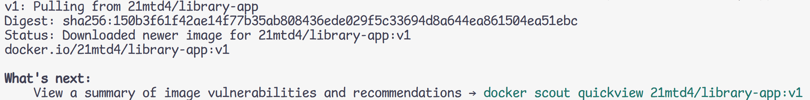
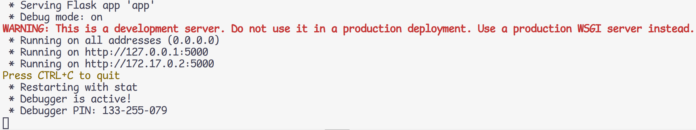

# Section 1 - A4 - Matt Dobaj - 20350312 - TA Group 1 - Nov. 28, 2025
Github repo: [https://github.com/dobaj/cisc327-library-management-a2-0312](https://github.com/dobaj/cisc327-library-management-a2-0312)

# Section 2 - E2E Testing Approach
I used Playwright as it seemed a lot easier to use compared to Selenium. I made use primarily of its `get_by_role` and `get_by_label` functions to find the elements on the page via their recommended approach, which is said to test accessibility better.

The main features I tested were first adding and borrowing a book, and second checking a books borrowed status and returning it. 

The add/borrow test first asserted that the add book page was reached from the home page. After adding the book, it asserted that the add book confirmation was shown and that the added book's details were correctly displayed in the catalog. After borrowing the book, it asserted that the successfully borrowed confirmation was shown.

The status/return test required the use of one of my previously made helper functions to borrow a book before the test began. It asserted that the borrowed book was present in the currently borrowed table and that the return success confirmation is shown to the user after returning the book. 

# Section 3 - Execution Instructions 
The tests require the server to be running, which can be done either with:
```python app.py```
or by running the docker container.

To run the container, you can use the command:

```docker run -p 5000:5000 21mtd4/library-app:v1```

or if you built it yourself:

```docker run -p 5000:5000 library-app```

You can run all tests using:

```pytest```

or you can run just the end to end tests using:

```pytest .\tests\test_e2e.py```

# Section 4 - Test Case Summary 
Test Function Name | Expected Results
--|--
test_add_and_borrow_book  | PASS
test_status_then_return | PASS

The results should look like this:



# Section 5 - Dockerization Process

After adding an example Dockerfile I found on the internet I could build the project using the following command:

```docker build -t library-app .```



I was then able to run the project after some slight modifications to the Dockerfile using the following command:

```docker run -p 5000:5000 library-app```



# Section 6 - Docker Hub Deployment

Docker Push:



Docker Remove:



Docker Pull:



Docker Run:



# Section 7 - Challenges and Reflections
I encountered some difficulties when trying to see where the testing was not producing expected results. In my add book test, for example, I couldn't see why the book wasn't being added. After a lot of trial and error, I discovered online that I could launch a browser manually in the foreground so that I could see what the tests were doing. This helped me see what element was failing but it didn't show me why the test was failing. I eventually realized that I was trying to click the link element of the "Add Book" button instead of the button itself. After fixing this, the test started performing normally. In hindsight I would probably start my testing process with the visible browser process sooner so that I could visually walk through the tests rather than guessing and checking.

